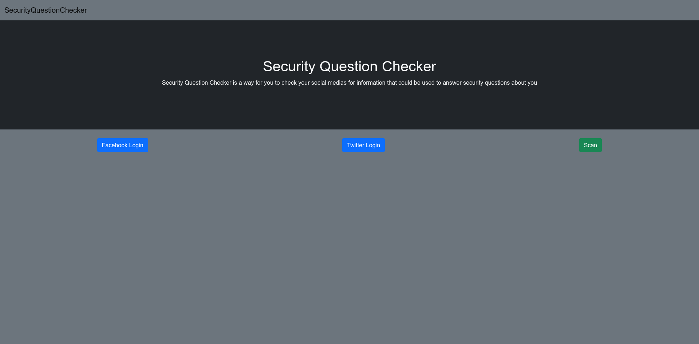

# Security Question Checker

IT 8010: IT Project
Summer 2021

Date:
June 31, 2021

## Abstract
Security questions are an important part of authentication solutions, mainly used as a form of secondary authentication when users forget their passwords.  With the current use of social media and access to personal information, security questions are now vulnerable to social engineering and reconnaissance. In this report, we overview the development of a website that allows users to scan their social media for potential security question answer leaks. This website is a preventative measure for users to check their social media and see if they have any personal information exposed that could be used against them.

## Introduction
With the ever growing popularity of social media people are sharing information like never before[1]. With this sharing of information, personal information that could be used maliciously is now easily accessible by malicious actors. One way this information can be used is to answer security questions[2][7]. Security questions are a form of authentication that relies on the questions being personal so that only the one user could answer them. This then leads to the ability to answer security questions by gathering data from peoples social media. The first step in a malicious cyber attack is reconnaissance[3][9][10]. So stopping this first step is a pivitol way in protecting yourself. My project and the topic of this paper is a security question checker website that people can use to check their social media for information that could lead to a security question answer.

## Problem Statement

Modern-day use of social media opens vulnerabilities in security questions as a form of authentication. Personal information posted by people online can be used to answer security questions for their accounts, thus granting access to the attacker. This attack technique can also be coupled with phishing and social engineering. Currently there is no platform for people to check their social media for information that malicious actors can use to answer security question about them.

## Research Question

Can a tool be created to let users know if their social media information can be used to answer security questions about them?

## Importance

This project is very significant to the security of individual people. This project provides people a preemptive way to check if what they post online can be used against them by malicious actors. It also helps spread awareness of the flaws of security questions brought to light due to the rise and use of social media. According to a study done at Robert Morris University, 89% of their participants reported using personal security questions [4]. That significant majority also said that they have at least one or more types of information that could be used to answer a security question about them. This data reaffirms that this is a serious problem and could be detrimental to individuals in the future. People embrace social media for its connectivity to others and how easy it is to meet new people. These positives to social media are great, but they are also a double-edged sword that could be used against them.

## Design
This section will be a technical overview of the web application design created to help solve the problem above. 

The web application is built on a node.js backend and a Vue.js frontend. Much of the data and information is analyzed through the backend and the frontend is mostly for logging a user in and showing that data gathered. When the user lands on the webpage, they are greeted with a few login buttons, each button corresponding to a social media website. They then use their respective social media account to log in; this gives us an access token that can be used to look at the users account and scan for information. 

Once logged in to either a Facebook account or a Twitter account, the user can then hit scan. This will then send a request to the backend that kicks off an analysis of the user’s account. The analysis looks for keywords in the users pass that would elude that the post reveals information that could be used to answer a security question. It also looks for information on the profiles about pages that could also reveal unwanted information, mainly only for Facebook profiles. The keyword list compared against the user’s posts is ever-growing and can be expanded on easily; this allows us just to add a keyword when we find that it corresponds to a security question. For example, if we want to look for information that could be used against the security question, “What is the make of your car”, we could look for the keywords; “car”, “truck”, “van” and flag the posts that contains those words as possibly revealing too much information. 

Once the backend is done looking for informaiton all the data gathered is sent to the frontend to be generated in an easy to view report. In this report the user can look at the posts and information flagged by the system and decide what to do with it. 

## Case Scenario

John is an avid social media user, he has accounts with Facebook and Twitter. Recently, he has been seeing more coverage in the news about people being hacked and having their information stolen. He is looking for ways to check his security posture online. Currently the only thing he has done is checking his passwords in websites like haveibeenpwned, but he knows that information on social media can be used against him so he is looking for something more. He finds the website securityquestionchecker and runs his social medias through it. He finds that some of his posts on his twitter account provide information that can be used to answer security questions about him. He now can go and delete the flagged posts and feel at ease that this information wont be used against him malicously.

## Limitations

This system is limited mainly by the social medias API’s that it interacts with for now being Facebook and Twitter[5][6]. Facebook’s API doesn’t allow you to access certain information, which prevents the system from looking at it to decide whether to flag it. It is also limited to the quality of the keywords it is given. The better the keywords the more likely it is to find a post that does reveal to much information.

## Conclusion

In conclusion, I believe this website can greatly help security-conscious people determine if their social medias contain sensitive information that can be used against them. As a preventative step to be taken it can greatly reduce the possibility of malicious actors using information gathered on social media against an individual. In this ever growing world of online communication information is at everyones fingertips and we have to make sure that the wrong information doesn’t get to the wrong people.

## References

[1] Ortiz-Ospina, Esteban. “The Rise of Social Media.” Our World in Data, 19 Sept. 2019, ourworldindata.org/rise-of-social-media#licence. 

[2] Rabkin, Ariel. "Personal knowledge questions for fallback authentication: Security questions in the era of Facebook." Proceedings of the 4th Symposium on Usable Privacy and Security. 2008.

[3]MITRE ATT&CK®, attack.mitre.org/.

[4] Pinchot, Jamie L., and Karen L. Paullet. "What’s in your profile? Mapping Facebook profile data to personal security questions." Issues in Information Systems 13.1 (2012): 284-293.

[5] Weaver, Jesse, and Paul Tarjan. "Facebook linked data via the graph API." Semantic Web 4.3 (2013): 245-250.

[6] Makice, Kevin. Twitter API: Up and running: Learn how to build applications with the Twitter API. " O'Reilly Media, Inc.", 2009.

[7] Schechter, Stuart, AJ Bernheim Brush, and Serge Egelman. "It's no secret. measuring the security and reliability of authentication via “secret” questions." 2009 30th IEEE Symposium on Security and Privacy. IEEE, 2009.

[8] Just, Mike, and David Aspinall. "Personal choice and challenge questions: a security and usability assessment." Proceedings of the 5th Symposium on Usable Privacy and Security. 2009.

[9] Strom, Blake E., et al. "Mitre att&ck: Design and philosophy." Technical report (2018).

[10] Xiong, Wenjun, et al. "Cyber security threat modeling based on the MITRE Enterprise ATT&CK Matrix." Software and Systems Modeling (2021): 1-21.
